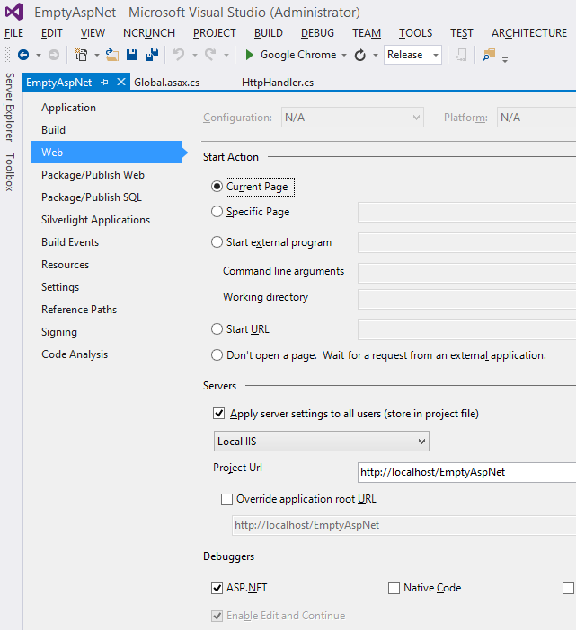

Benchmarking ASP.NET
============================

This test is to check how fast ASP.NET is.


# download apache

http://www.apachehaus.com/cgi-bin/download.plx

No need to install it. You just need the benchmarking tool `bin\ab.exe`.

# create an empty ASP.NET application.

Make sure that the project is empty without MVC config etc.

Add the following class:

```csharp
public class Global : System.Web.HttpApplication
{

    protected void Application_Start(object sender, EventArgs e)
    {

    }

    protected void Session_Start(object sender, EventArgs e)
    {

    }

    protected void Application_BeginRequest(object sender, EventArgs e)
    {
        Response.ContentType = "text/plain";
        Response.Output.WriteLine("HelloWorld");
        Response.Output.Flush();
        Response.End();
    }

    protected void Application_AuthenticateRequest(object sender, EventArgs e)
    {

    }

    protected void Application_Error(object sender, EventArgs e)
    {

    }

    protected void Session_End(object sender, EventArgs e)
    {

    }

    protected void Application_End(object sender, EventArgs e)
    {

    }
}
```

Compile the project and add it as a virtual folder in IIS:



# Run benchmarking

```
ab -n 10000 -c 50 -k http://localhost/emptyaspnet/
```

Make sure that `-n` and `c` is the same of my server and ASP.NET
