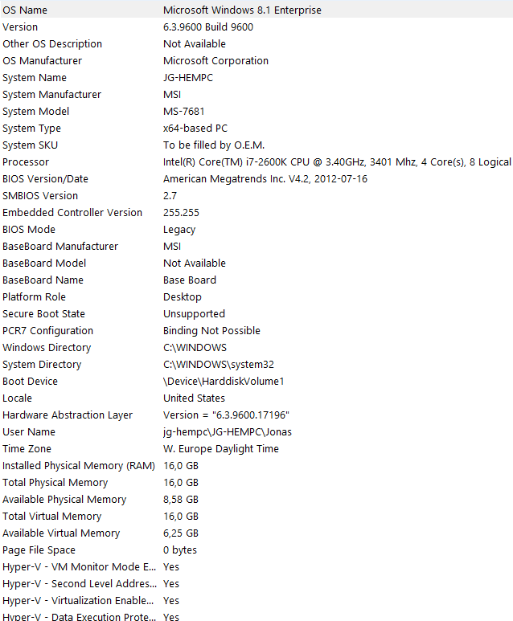

Weblight
==========

License: https://creativecommons.org/licenses/by-sa/2.0/


This is a one day hack from using my experience with the networking library in SharpMessaging and Griffin.Framework.

Have done no tries to do performance improvements. Have just tried to reduce the number of allocations and merge outbound messages before triggering the socket (works great for other protocols or when pipelining is used in HTTP).

# Testrun

## 100 000 requests asked (50 concurrent).

Memory usage at startup: 145Mb (preloaded buffers and network channels)
Memory usage after test: 151Mb

```text
C:\Users\Jonas\Desktop\tmp>ab -n 100000 -c 50 -k http://127.0.0.1:8844/
This is ApacheBench, Version 2.3 <$Revision: 1638069 $>
Copyright 1996 Adam Twiss, Zeus Technology Ltd, http://www.zeustech.net/
Licensed to The Apache Software Foundation, http://www.apache.org/

Benchmarking 127.0.0.1 (be patient)
Completed 10000 requests
Completed 20000 requests
Completed 30000 requests
Completed 40000 requests
Completed 50000 requests
Completed 60000 requests
Completed 70000 requests
Completed 80000 requests
Completed 90000 requests
Completed 100000 requests
Finished 100000 requests


Server Software:        Dummy
Server Hostname:        127.0.0.1
Server Port:            8844

Document Path:          /
Document Length:        10 bytes

Concurrency Level:      50
Time taken for tests:   11.326 seconds
Complete requests:      100000
Failed requests:        0
Keep-Alive requests:    100000
Total transferred:      12800000 bytes
HTML transferred:       1000000 bytes
Requests per second:    8828.95 [#/sec] (mean)
Time per request:       5.663 [ms] (mean)
Time per request:       0.113 [ms] (mean, across all concurrent requests)
Transfer rate:          1103.62 [Kbytes/sec] received

Connection Times (ms)
              min  mean[+/-sd] median   max
Connect:        0    0   0.0      0       1
Processing:     2    6   2.3      5     105
Waiting:        2    6   2.2      5     102
Total:          2    6   2.3      5     105

Percentage of the requests served within a certain time (ms)
  50%      5
  66%      6
  75%      7
  80%      7
  90%      8
  95%      9
  98%     11
  99%     12
 100%    105 (longest request)
 ```
 
 
 
 